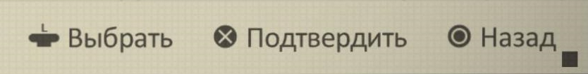

	<h2><b>PS4 (Dualshock 4) кнопки для NieR Automata</b> c руссификацией от ZOG</h2>
	

 

# Основная информация
- Данный патчер меняет полностью все иконки кнопок в **NieR: Automata** c Xbox стиля на PS4 *(Dualshock 4)*
- Теперь совместим с последними обновлениями игры и локализации
- Разработчики поленились добавить поддержку разных геймпадов, а [DualShock 4 Button Prompts](https://community.pcgamingwiki.com/files/file/870-nier-automata-dualshock-4-button-prompts/) за авторством Erewego совсем не дружит с [локализацией от ZOG](https://forum.zoneofgames.ru/topic/42805-nier-automata/). Вот и пришлось допиливать все своими ручками
- Мод был проверен на лицензионной Steam версии. Если вы не имеете лицензионной копии игры, то гарантировать стабильную работу мода я вам не могу.
- В репозитории есть все инструменты для ручного патчинга архивов в случае если что-то пойдет не так, все поломается, весь мир сгорит до тла и вам срочно понадобится исправить все самому. Я уверен - ты сможешь это сделать. Просто тебе придется прочитать немного документации ниже *(которую я еще не написал)*.
- Оригинальный автор текстур PS4 Dualshock - [Spodi](https://www.nexusmods.com/nierautomata/mods/174)

# Установка
1. [Скачать архив с патчером](https://github.com/maximilionus/NierA-ZOG-PS4-Prompts/releases/latest/download/PS4_Prompts_ZOG_Patcher.zip) *(Самая актуальная версия)*
2. Распаковать файл `PS4 Prompts ZOG Patcher.exe` в корневую папку игры *(или же `<Директория_NieRAutomata>\data\ui`)*
3. Запустить `PS4 Prompts ZOG Patcher.exe` и дождаться завершения работы
4. Все готово, можно играть
